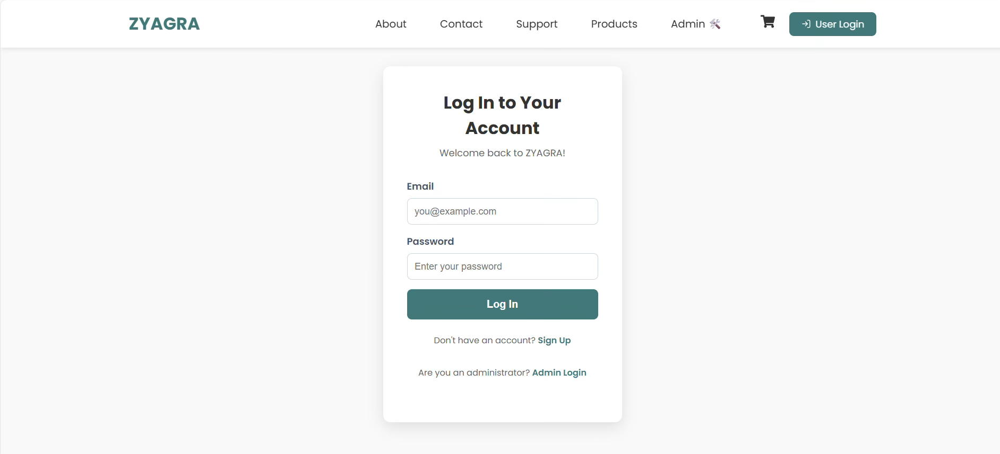
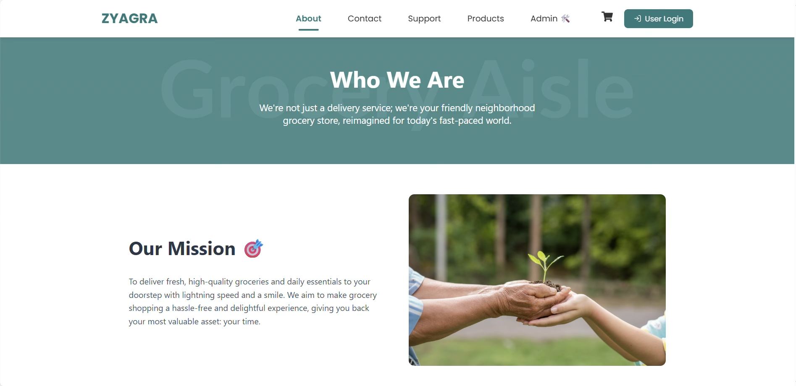
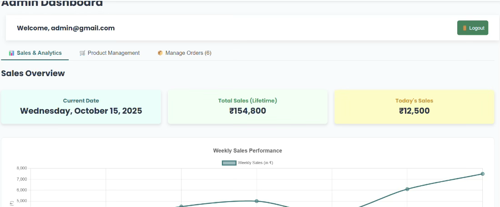
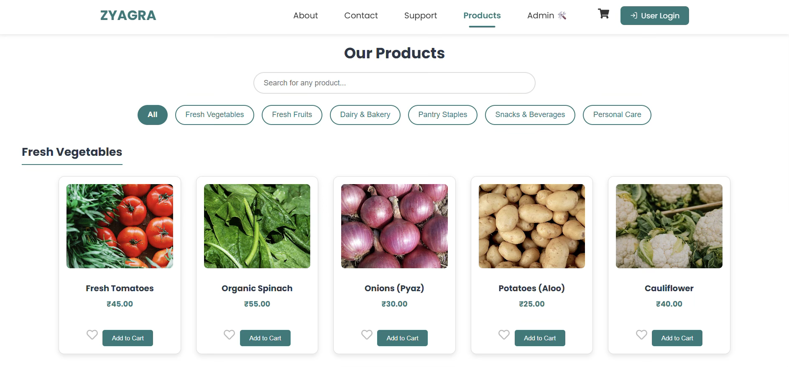
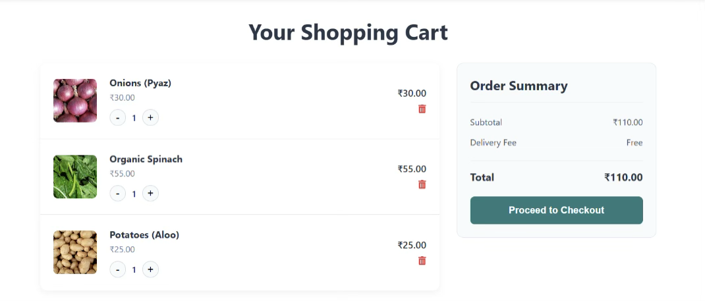
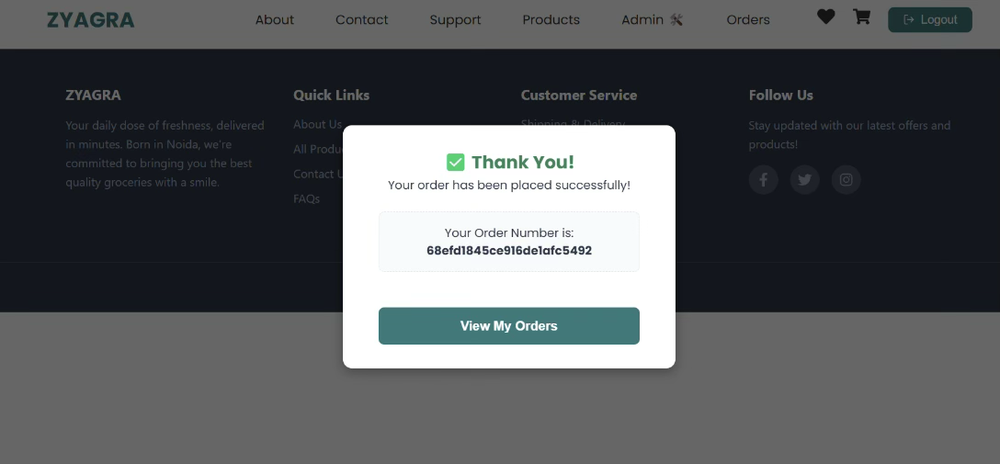
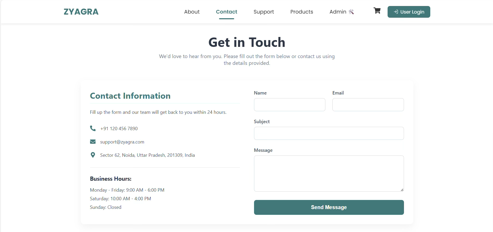

# 🌾 ZYAGRA – Farmer-to-Consumer 
ZYAGRA is an e-commerce web application designed to connect farmers directly with consumers, promoting organic products and encouraging sustainable agriculture. It facilitates the sale and purchase of fresh farm produce, dairy items, and other organic products by streamlining the supply chain from land to consumer.

---
## 🛠️ Platform Overview
### 1. Login


### 2. About


### 3. Admin Dashboard


### 4. Product Dashboard


### 5. Cart


### 6. Payment Dashboard


### 7. Contact



## 📌 Features
- 🥬 Direct Farmer-Consumer Connection: Consumers can browse and buy fresh organic products directly from farmers.
- 🛒 E-Commerce Functionality: Add to cart, checkout, and track orders seamlessly.
- 🌱 Organic Product Catalog: Wide range of vegetables, fruits, dairy, and other organic items.
- 📦 Order Management: Farmers can manage product availability and track orders.
- 🔐 User Authentication: Secure sign-up and login for farmers and consumers with session management.
- 💳 Payment Simulation: Integrated payment flow for a realistic e-commerce experience.
- 📊 Analytics & Dashboard: Farmers and admin can view sales, inventory, and product performance.

---

## 🛠️ Tech Stack

| Technology | Purpose |
|------------|---------|
| **React.js** | Frontend UI development |
| **Node.js & Express.js** | Backend server & API routing |
| **MongoDB** | NoSQL Database for storing products, users, and orders |
| **HTML/CSS/Bootstrap** | UI structure and styling |
| **JavaScript** | Client-side interactivity |
| **Axios / Fetch API** | Communication between frontend and backend |

---

## 📂 Modules

1. **User Authentication** – Sign-up, login, and session management for farmers and consumers.
2. **Product Catalog** – Display and manage organic products.
3. **Cart & Checkout** – Add, remove, and purchase products securely.
4. **Order Management** – Track orders and update order status.
5. **Farmer Dashboard** – Upload products, manage inventory, view sales.
6. **Consumer Dashboard** – Browse products, place orders, and view purchase history.
7. **Admin Panel** – Control users, manage categories, and oversee platform activities.
8. **Payment Simulation** – Integration of simulated payments for testing the checkout process.

---

## 🔐 Security Features

- Role-based access control (Farmer/Consumer/Admin)

- Passwords hashed with bcrypt

- Input validation and sanitization to prevent XSS/SQL Injection

- Secure session management and token-based authentication (JWT)

---

## 📦 Installation Guide

1. **Clone the repository**
   ```bash
   git clone https://github.com/your-username/zyagra.git

2. **Install Backend Dependencies**
   ```bash
   cd zyagra/backend
   npm install

3. **Install Frontend Dependencies**
   ```bash
   cd ../client
   npm install

4. **Configure Environment Variables**
   - Create a .env file in server/
   - Add:
   ```bash
   MONGO_URI=your_mongodb_connection_string
   JWT_SECRET=your_jwt_secret
   PORT=

5. **Start the Backend**
   ```bash
   cd server
   npm start

6. **Start the Frontend**
   ```bash
   cd client
   npm start

7. **Open the Application**
   ```bash
   http://localhost:

---

## 🧪 Testing

- Unit testing for API endpoints and React components

- Integration testing between frontend and backend

- Functional testing of cart, checkout, and order flow

---

## 👥 Contributors

| Name | Role |
|------------|---------|
| **Yasmin D, Christ University** | Backend Developer, Database modelling |
| **Sandeep Kumar, Christ University** | Frontend Developer |
| **Srishti Yadav, Christ University** | Frontend Developer |
| **Minakshee, Christ University** | UI Design |

---
